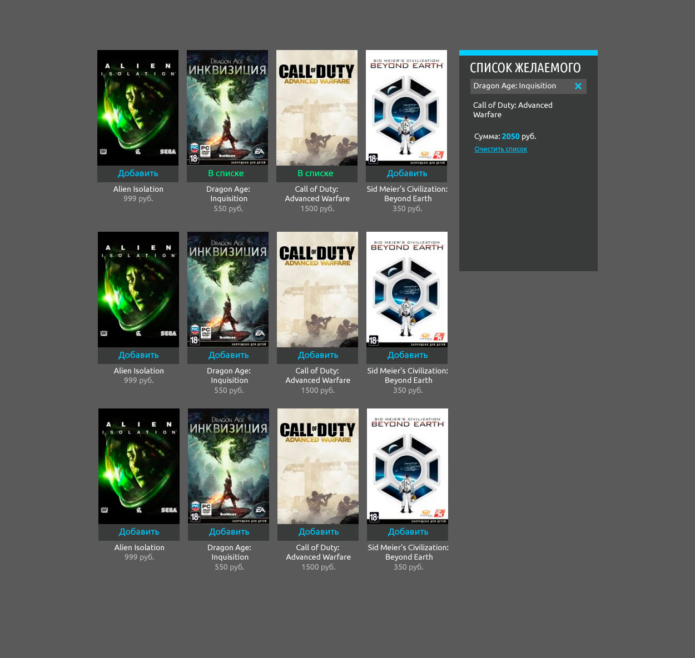

#Тестовое задание “Список желаемого” enaza



Необходимо реализовать “список желаемого”. 
Система должна позволять добавлять в список игры из каталога, 
удалять игры из списка, 
очищать список, 
автоматически подсчитывать сумму добавленных в список игр.

В приложении макет который необходимо сверстать и json файл в котором находится каталог продуктов с названиями, 
ценами и обложками.

* Шрифты Ubuntu и Ubuntu Condensed подключить из Google Fonts.
* адаптивная верстка, использование препроцессоров - опционально, желательно
* Каталог игр и список желаемого должны быть реализованы через JavaScript шаблоны. 
* Добавление в список происходит при щелчке на кнопке “Добавить” (плюсом будет реализация этого действия и через drag-n-drop). 
* При добавлении кнопка должна смениться на “В списке”, должна автоматически пересчитаться итоговая сумма добавленных в список игр. 
* Список должен сохраняться в localstorage. 
* Необходимо все реализовать на frontend, без серверной части.
* Обязательно использовать следующие библиотеки и фреймворки: `knockoutjs` или `backbonejs`

Предположительное время выполнения задания - 8 часов.
Не расстраивайтесь, если не укладываетесь в рекомендованное время!

## Запуск:
```bash
npm start
```
[Открыть в браузере](http://localhost:8080/)
